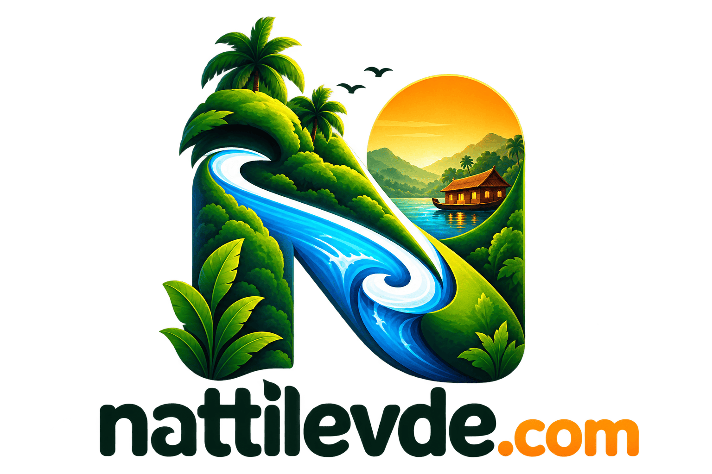

<p align="center">
  
</p>

# Kerala Unfolded

A stylised 3D open-world exploration game set in Kerala, with an illustrated
portal covering all 14 districts. No crime, no combat, no weapons — the point is
to wander, notice things, and keep what you find in a passport of your own.

Built with React, Vite and Three.js. Everything runs in the browser: there is no
backend, no account, and no analytics.

> **v0.3.0 — release candidate.** The latest published tag is v0.2.0.
> See the [release checklist](docs/RELEASE_READINESS.md) for validation and deployment
> status. Being pre-1.0, the world's data shapes and saved progress
> may still change between minor versions. See the
> [changelog](CHANGELOG.md) for what is in this release, and
> [scope and limitations](#scope-and-limitations) for what it is not.

## Quick start

Requires Node 20 or newer.

```sh
npm install
npm run dev
```

Open <http://localhost:5174>. The 3D world is at `/#world`, or via **Enter the
3D World** from the portal.

### Checks

```sh
npm run format:check
npm run build
npx playwright install chromium   # first run only
npm test
```

## Playing

Use **WASD** or the arrow keys to walk, **Shift** to run, drag to look around,
and **E** to interact when near a local, a landmark, or a place to sit. **R**
borrows or parks the scooter, **B** calls up the bus network, **M** opens the
map, **P** opens the passport, and **Escape** pauses. Touch devices get a
movement joystick and a running toggle; drag the scenery to look around.

Start along the village lane. The tea shop is to the left, and locals offer
clues to the courtyard, the jetty, the paddies and the kavu. The coastal highway
runs the length of the world — north through Spice Lane, the river bridge and
the beach market to the sea fort, south past Ashtamudi to the lighthouse — while
the hill road east climbs to tea country, a waterfall and a cloud viewpoint.
Borrow the canoe from Binu at the jetty: A and D steer, W and S paddle, and it
glides for a while after you stop.

Sound is worth turning on. The world is mixed by distance and direction, so a
drum you can barely hear is a place you can walk to.

## What is in it

**The portal** — an illustrated, keyboard-accessible map of all 14 districts,
with 28 place discoveries, 14 food discoveries, 14 regional cultural stories,
place and district search, a contextual offline guide, and a local-storage
passport with district stamps and quest badges.

**The world** — five regions covering the 14 districts in miniature: the Malabar
Coast (a laterite sea fort, a beach market, a Theyyam ground), Central Kerala
(river ghat, a Pooram ground with caparisoned elephants, Spice Lane), the High
Ranges (contoured tea slopes, a waterfall, a cloud viewpoint, forest), the
Backwaters (the village where you start), and Travancore South (the Ashtamudi
lagoon, a heritage street, a red-banded lighthouse). One highway joins them end
to end.

**Exploring** — 23 discoverable places including two hidden ones, nine
exploration activities, hands-on encounters (chenda beats, the coir spindle,
blending masala, plucking tea), seven quiet rest spots that settle the camera
into a slow drifting view, traveller ranks from New Arrival to Naattukaaran, and
a fog-of-discovery map.

**Getting around** — walking, a borrowable scooter, a paddled canoe, and a bus
network. Region stands open as your journey grows, and every place you have
already found becomes a destination of its own, so first visits are earned and
return trips are free.

**A world that is doing something** — monsoon showers roll in and pass while
villagers seek shelter, Radha covers her fibre, and practice pauses; a passenger
boat connects the village landings; dolphins arc off the coast; a peacock fans its tail on the Pooram ground;
fireflies come out at night in the sacred grove.

**Sound** — a layered soundscape synthesised entirely in the browser from noise
buffers and oscillators. Surf that follows the nearest shoreline, chenda melam
that accelerates the way a real one builds, a chaayakkada's stove and glasses,
market calls, regional autos and bus horns, a passenger boat's oars, rain and
distant thunder. Village practice and passenger-boat cues follow actual activity.

**Kerala overheard, not explained** — short transliterated Malayalam surfaces as
a subtitle when you pass the right place, glossed only where the meaning would
be lost, with dialect that shifts north to south. Nothing to dismiss.

## The living village prototype

The next development phase starts in Kadal: twelve persistent residents, a shared
clock, sheltering and interrupted work, available rehearsal partners, and a small
passenger service. Follow the activity, or leave it to carry on. Contextual moments
join the existing passport, and the day resumes when you return.

Exploration assistance and directional captions are available in the pause menu.
The default view keeps objectives and discovery counts out of the landscape.
See [the design](docs/NEXT_EVOLUTION_DESIGN.md) and
[what is implemented and still needs playtesting](docs/KADAL_PHASE_ONE.md).

## Project structure

```
├── .github/            issue and PR templates, CI workflow
├── docs/               architecture, content authoring, credits
├── src/
│   ├── main.jsx        entry point
│   ├── portal/         the 2D district portal (React)
│   │   ├── App.jsx
│   │   ├── KeralaMap.jsx
│   │   ├── data.js
│   │   └── styles.css
│   └── game/           the 3D world (Three.js), lazy-loaded
│       ├── world.js        model: terrain, collision, sites, travel, boat physics
│       ├── environment.js  scene construction and ambient animation
│       ├── engine.js       render loop, controller, camera, input
│       ├── audio.js        positional soundscape
│       ├── culture.js      overheard lines
│       ├── Game.jsx        HUD, map, passport
│       └── game.css
├── tests/              Playwright: model checks and browser tests
├── index.html
├── playwright.config.js
└── vite.config.js
```

- [docs/ARCHITECTURE.md](docs/ARCHITECTURE.md) — how the pieces fit together
- [docs/CONTENT.md](docs/CONTENT.md) — adding a place, rest spot, line or sound
- [docs/CREDITS.md](docs/CREDITS.md) — third-party photos, fonts and licences

## Scope and limitations

The 3D world is a stylised, compressed Kerala: five macro-regions along one
continuous strip, with landmarks inspired by recognisable places (Bekal, Munnar,
Thrissur, Ashtamudi, Kovalam) rather than geographic replicas. Place names in
the world are fictional. Each region carries a handful of landmarks today and
can grow into fuller district chapters using the same world definitions.

There is no combat, traffic simulation, building interiors, multiplayer, or
advanced weather beyond rain. The canoe and ambient vehicles are intentionally
simple. The portal's guide uses curated content and intent matching, not a
language model or live travel data.

Progress is saved in the browser only. Portal fonts and photography need network
access; the 3D world downloads no models, textures or audio, and synthesises its
whole soundscape at runtime, so it needs Web Audio and starts only once you turn
sound on. WebGL and hardware acceleration are recommended; a lightweight
graphics mode disables shadows. District boundaries on the portal map are
illustrative, and some portal photographs are representative scenery rather than
documentary images of the named place.

There is no ESLint or type checking configured yet — only Prettier. The 3D world
has not been profiled on low-end mobile hardware.

## Planned next

Roughly in the order they would be useful, and deliberately short — this is
what is actually being considered, not a roadmap of promises:

- Depth over breadth in the existing regions: more to find and do in the five
  that exist, rather than new ground.
- ESLint, and a look at whether type checking earns its keep here.
- Performance work on mid-range phones.
- Recording brand-artwork provenance and per-photo attribution properly.

## Contributing

Corrections from people who know a place, a tradition or the language
first-hand are especially welcome. See [CONTRIBUTING.md](CONTRIBUTING.md) for
the branching model and release process, and the
[Code of Conduct](CODE_OF_CONDUCT.md).

## Support

This is built and maintained in spare time. If it made you want to go for a
wander, you can [buy me a coffee](https://www.buymeacoffee.com/nabeelc) — or
scan the code.

<p align="center">
  <a href="https://www.buymeacoffee.com/nabeelc">
    
  </a>
</p>

## Licence

Source code is [MIT](LICENSE). Photographs, fonts and other third-party material
keep their own licences — see [docs/CREDITS.md](docs/CREDITS.md) before you fork
or redeploy.
